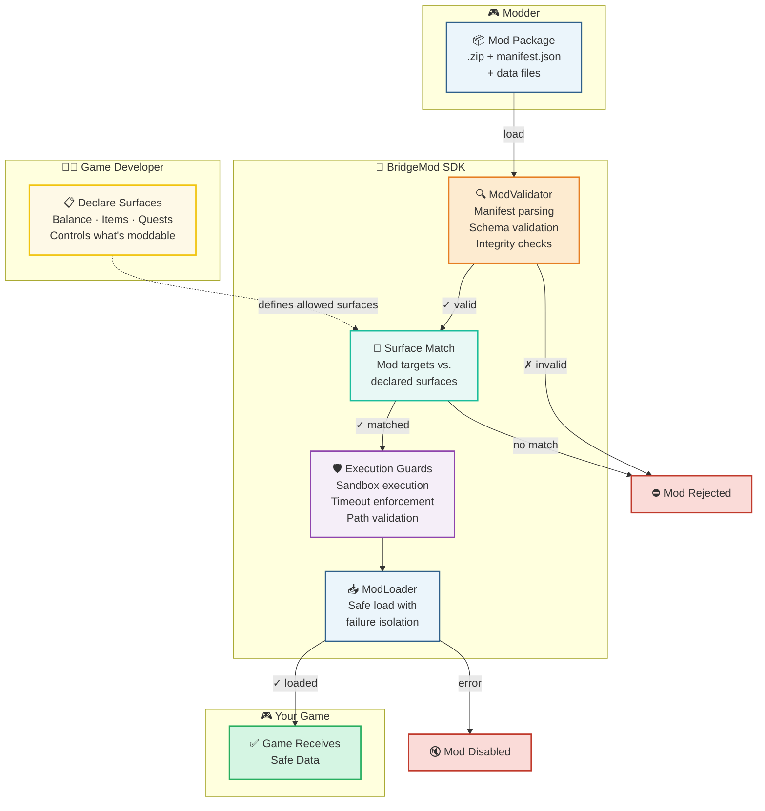

# 🌉 BridgeMod

**Bridging the gap between developers who want mod safety and modders who want clarity.**

BridgeMod is a developer-first modding platform designed to give game developers confidence that mods won't break their game, while giving modders transparent expectations about what they can create.

Build your mod system once. It works on PC, ports to console, and never needs rearchitecting. Built on trust, not restriction.

[](https://www.nuget.org/packages/BridgeMod.SDK/) [](LICENSE) [](https://github.com/rootedresilientshop-pixel/BridgeMod/actions/workflows/build.yml)

### 🚀 Status: v0.3.0 Live
**Milestone:** Phase 2 (Developer Mod Surfaces) — **Complete** ✅
**Previous:** Phase 1 (Security Foundation) — **Complete** ✅
**Latest News:** [Phase 2 — Developer Mod Surface Declarations (Feb 2026)](https://github.com/rootedresilientshop-pixel/BridgeMod/discussions)
## Why BridgeMod Exists

We believe:

- **Developers deserve confidence.** Mods shouldn't be a risk. They should be a feature.
- **Modders deserve clarity.** If a mod surface is closed, they should know why. If it's open, they should know the rules.
- **Build once, port everywhere.** The same mod system should work on PC today and console tomorrow — no ripping out Steam Workshop, no rearchitecting for certification.

[Read our principles →](CONSTITUTION.md)

## What BridgeMod v1 Does

✅ **Pure Data Mods** - JSON configs, balance changes, anything data-driven

✅ **Behavior Graphs** - State machines and ECA rules without scripts

✅ **Procedural Control** - Seeds and generation parameters

✅ **Sandbox Execution** - Mods can't crash your game, no matter what

✅ **Transparent Surfaces** - Modders see exactly what's moddable

✅ **Local Validation** - Works offline, no cloud dependency required

### How It Works

Every mod passes through validation, surface matching, and sandbox guards before your game sees it. Nothing gets through unchecked.


```mermaid
flowchart TD
    subgraph MODDER["🎮 Modder"]
        A["📦 Mod Package\n.zip + manifest.json\n+ data files"]
    end

    subgraph BRIDGEMOD["🌉 BridgeMod SDK"]
        B["🔍 ModValidator\nManifest parsing\nSchema validation\nIntegrity checks"]
        C["🎯 Surface Match\nMod targets vs.\ndeclared surfaces"]
        D["🛡️ Execution Guards\nSandbox execution\nTimeout enforcement\nPath validation"]
        E["📥 ModLoader\nSafe load with\nfailure isolation"]
    end

    subgraph GAME["🎮 Your Game"]
        F["✅ Game Receives\nSafe Data"]
    end

    subgraph DEV["👨‍💻 Game Developer"]
        G["📋 Declare Surfaces\nBalance · Items · Quests\nControls what's moddable"]
    end

    A -->|load| B
    B -->|"✓ valid"| C
    B -->|"✗ invalid"| R1["⛔ Mod Rejected"]
    C -->|"✓ matched"| D
    C -->|"no match"| R1
    G -.->|"defines allowed surfaces"| C
    D --> E
    E -->|"✓ loaded"| F
    E -->|"error"| R2["🔇 Mod Disabled"]

    style A fill:#EBF5FB,stroke:#2E5F8A,stroke-width:2px
    style B fill:#FDEBD0,stroke:#E67E22,stroke-width:2px
    style C fill:#E8F8F5,stroke:#1ABC9C,stroke-width:2px
    style D fill:#F5EEF8,stroke:#8E44AD,stroke-width:2px
    style E fill:#EBF5FB,stroke:#2E5F8A,stroke-width:2px
    style F fill:#D5F5E3,stroke:#27AE60,stroke-width:2px
    style G fill:#FEF9E7,stroke:#F1C40F,stroke-width:2px
    style R1 fill:#FADBD8,stroke:#C0392B,stroke-width:2px
    style R2 fill:#FADBD8,stroke:#C0392B,stroke-width:2px
```

## Repository Structure

```
BridgeMod/
├── src/
│   ├── BridgeMod.SDK/              # C# Firewall SDK (NuGet: BridgeMod.SDK)
│   │   ├── BridgeMod.Bridge.cs    # Public API: ModBridge, AuditLogger, BridgeConfig
│   │   ├── BridgeMod.SDK.csproj   # NuGet package (net8.0 + netstandard2.1)
│   │   ├── IsExternalInit.cs      # C# 9+ polyfill for netstandard2.1
│   │   └── README.md              # SDK-specific documentation
│   └── DreamCraft.Engine/          # Python simulation engine (DreamCraft: Legacies)
│       ├── simulation/             # 4-stage pulse engine
│       ├── api/                    # FastAPI REST + WebSocket
│       ├── llm/                    # Ollama-compatible LLM client
│       ├── data/                   # Schema, seed, SQLite setup
│       └── ...                     # Config, Docker, Makefile
├── samples/
│   └── Legacies_Bridge_Test/       # Integration sample (C# + Python)
│       ├── Program.cs              # Annotated sample runner
│       ├── pulse_test.py           # Python pytest validation suite
│       └── Sample_Walkthrough.md  # Step-by-step developer tutorial
├── tests/                          # SDK unit tests
├── tools/                          # ModPackager, SchemaValidatorCLI
├── docs/                           # Architecture and design docs
├── examples/                       # Example mods
└── .github/                        # CI/CD workflows
```

---

## Platform Support

**BridgeMod works with any C# / .NET 10.0+ platform:**

- ✅ **Unity** (C# scripting, any supported version)
- ✅ **Godot 4.x+** (C# support)
- ✅ **Custom C# Game Engines**
- ✅ **Console Development** (Xbox, PlayStation with .NET compatible runtimes)
- ✅ **Porting-Friendly** — same mod code runs on every target platform
- ✅ **Any .NET 10.0+ Application**

Build your mod system on PC. When you port to console, BridgeMod comes with you — same code, same validation, same safety guarantees.

## Getting Started

### For Game Developers

```bash
dotnet add package BridgeMod.SDK
```

Then declare your mod surfaces:

```csharp
var surfaces = new ModSurfaceDeclaration("MyGame", "1.0.0");
surfaces.DeclareDataSurface("Balance", "Weapon balance", "data/balance.json");
```

Load mods safely:

```csharp
var loader = new ModLoader(new ModValidator());
var mod = loader.LoadMod("my_mod.zip");
```

**→ [Full Quickstart Guide](QUICKSTART.md)**

### For Modders

1. Check what surfaces your favorite game supports (auto-generated `MOD_SURFACES.md`)
2. Create mods matching those surfaces
3. Package as `.zip` with `manifest.json`
4. Drop in the game's `mods/` folder

**→ [Mod Creation Guide](MOD_SCHEMA.md)**

## Documentation

| Document | Purpose |
|----------|---------|
| [QUICKSTART.md](QUICKSTART.md) | Get up and running in 10 minutes |
| [README_DEVELOPMENT.md](README_DEVELOPMENT.md) | Full API reference and implementation details |
| [CONSTITUTION.md](CONSTITUTION.md) | Our governing principles—the "why" behind everything |
| [MOD_SCHEMA.md](MOD_SCHEMA.md) | Mod package format specification |
| [Roadmap & Execution Plan](docs/internal/console_modding_execution_plan.md) | Full roadmap (Phases 1-5) |
| [Implementation Status](docs/internal/IMPLEMENTATION_STATUS.md) | Project status and architecture |

## Contributing

We welcome contributions. Before you start:

1. Read [CONSTITUTION.md](CONSTITUTION.md) - understand our principles
2. Check [CONTRIBUTING.md](CONTRIBUTING.md) - our guidelines and expectations
3. Follow our [Code of Conduct](CODE_OF_CONDUCT.md)

Whether it's a typo fix, a bug report, or a feature idea—we appreciate your help bridging the gap.

## License

MIT License. See [LICENSE](LICENSE) for details.

---

## Phase 2 — Developer Mod Surfaces

**Status: Complete ✅**

Phase 2 introduces a declarative governance layer that allows game developers to formally register the mod surfaces their game exposes. This is a transparency and documentation layer — it carries no runtime behavior.

### Purpose

Phase 2 exists to answer one fundamental question for every game that ships BridgeMod:

> *Which parts of this game can be modded, by whom, and under what constraints?*

Without a formal answer, modders guess and developers scramble. With Phase 2, the host declares surfaces explicitly — and the SDK can generate a human-readable capability matrix from those declarations automatically.

### Surface Categories

| Category | What It Covers |
|----------|---------------|
| `Data` | JSON configs, stat tables, balance sheets, item definitions — anything data-driven. No executable content. |
| `BehaviorGraphs` | State machines and event-condition-action (ECA) rule graphs expressed as declarative node structures. No scripting. |
| `ProceduralInputs` | Seeds, weightings, and generation parameters for procedural systems. Numeric and symbolic values only. |

### Surface Status Values

| Status | Meaning |
|--------|---------|
| `Enabled` | Fully open for modding within declared constraints. |
| `Limited` | Available with reduced scope or additional restrictions. |
| `Disabled` | Exists but is not available for modding. Declared for transparency. |
| `Planned` | On the roadmap — declared early to signal intent. |

### Capability Matrix

The `ModSurfaceSummaryGenerator` accepts a populated `ModSurfaceRegistry` and produces a formatted, human-readable capability matrix string. It groups surfaces by category (alphabetically) and orders surfaces within each group alphabetically by name.

**Example output:**

```
=== MyGame — Mod Capability Matrix ===

[BehaviorGraphs]
  EnemyAI [Limited]
    Enemy decision trees — read-only graph nodes only.

[Data]
  CharacterStats [Enabled]
    Stat tables for all playable characters.
  WeaponBalance [Enabled]
    Weapon base damage and scaling factors.

[ProceduralInputs]
  WorldSeed [Disabled]
    Reserved for host use only.
```

### What Phase 2 Does NOT Introduce

- **No scripting.** No executable content of any kind.
- **No runtime execution changes.** Validation, audit logging, and firewall behavior are unmodified.
- **No deterministic integrity changes.** The execution pipeline remains 100% deterministic.
- **No new dependencies.** Pure .NET — no external packages.
- **Mods cannot declare surfaces.** Only the host (game developer) registers surfaces. Mods have no access to the registry.
- **Host retains full control.** Status values are governance metadata; enforcement is the host's responsibility.

### Example Usage

```csharp
// During game initialization — register your mod surfaces
var registry = new ModSurfaceRegistry();

registry.Register(new ModSurfaceDeclaration(
    name: "WeaponBalance",
    category: ModSurfaceCategory.Data,
    status: ModSurfaceStatus.Enabled,
    description: "Weapon base damage and scaling factors."));

registry.Register(new ModSurfaceDeclaration(
    name: "EnemyAI",
    category: ModSurfaceCategory.BehaviorGraphs,
    status: ModSurfaceStatus.Limited,
    description: "Enemy decision trees — read-only graph nodes only."));

// Generate the capability matrix for documentation or display
string matrix = ModSurfaceSummaryGenerator.Generate(registry, "MyGame");
// Consume as needed — write to file, serve via API, display in-game, etc.
```

See [docs/Phase2_Mod_Surfaces.md](docs/Phase2_Mod_Surfaces.md) for the full architectural reference.

Phase 2 establishes a formal governance layer for mod exposure. Future phases will build upon this structured foundation while preserving deterministic execution guarantees.

---

## What's Next (Phase 3+)

From our [roadmap](docs/internal/console_modding_execution_plan.md):

- **Phase 3:** Behavior graph runtime executor
- **Phase 4:** Procedural control layer
- **Phase 5:** Optional cloud validation services

We're building toward a world where a game's mod system survives the port from PC to console without a rewrite. Phase by phase, stability over speed.

---

**BridgeMod is a passion project.** We're learning as we go. If you believe in safer, more transparent modding—whether you're a developer or a modder—you're welcome here.

Let's build something that makes both sides trust each other a little more. 🌉
