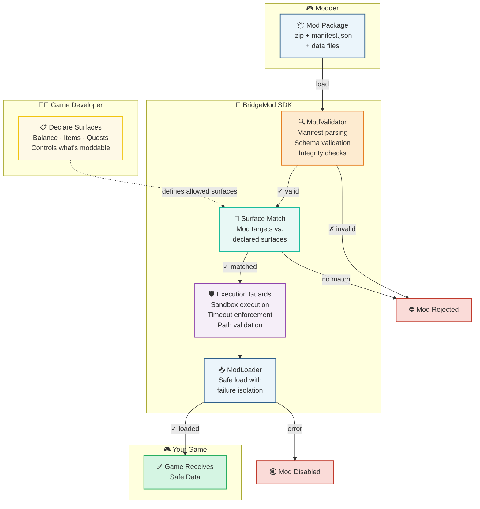

# 🌉 BridgeMod

**Bridging the gap between developers who want mod safety and modders who want clarity.**

BridgeMod is a developer-first modding platform designed to give game developers confidence that mods won't break their game, while giving modders transparent expectations about what they can create.

Build your mod system once. It works on PC, ports to console, and never needs rearchitecting. Built on trust, not restriction.

[](https://www.nuget.org/packages/BridgeMod.SDK/) [](LICENSE) [](https://github.com/rootedresilientshop-pixel/BridgeMod/actions/workflows/build.yml)

### 🚀 Status: v0.4.1 Live
**Milestone:** Phase 3 (Behavior Graph Runtime) — **Complete** ✅
**Previous:** Phase 2 (Developer Mod Surfaces) — **Complete** ✅
**Previous:** Phase 1 (Security Foundation) — **Complete** ✅
**Latest News:** [Phase 3 — Deterministic Behavior Graph Runtime (Feb 2026)](https://github.com/rootedresilientshop-pixel/BridgeMod/discussions)
## Why BridgeMod Exists

We believe:

- **Developers deserve confidence.** Mods shouldn't be a risk. They should be a feature.
- **Modders deserve clarity.** If a mod surface is closed, they should know why. If it's open, they should know the rules.
- **Build once, port everywhere.** The same mod system should work on PC today and console tomorrow — no ripping out Steam Workshop, no rearchitecting for certification.

[Read our principles →](CONSTITUTION.md)

## What BridgeMod v1 Does

✅ **Pure Data Mods** - JSON configs, balance changes, anything data-driven

✅ **Behavior Graphs** - State machines and ECA rules without scripts

✅ **Procedural Control** - Seeds and generation parameters

✅ **Sandbox Execution** - Mods can't crash your game, no matter what

✅ **Transparent Surfaces** - Modders see exactly what's moddable

✅ **Local Validation** - Works offline, no cloud dependency required

### How It Works

Every mod passes through validation, surface matching, and sandbox guards before your game sees it. Nothing gets through unchecked.


```mermaid
flowchart TD
    subgraph MODDER["🎮 Modder"]
        A["📦 Mod Package\n.zip + manifest.json\n+ data files"]
    end

    subgraph BRIDGEMOD["🌉 BridgeMod SDK"]
        B["🔍 ModValidator\nManifest parsing\nSchema validation\nIntegrity checks"]
        C["🎯 Surface Match\nMod targets vs.\ndeclared surfaces"]
        D["🛡️ Execution Guards\nSandbox execution\nTimeout enforcement\nPath validation"]
        E["📥 ModLoader\nSafe load with\nfailure isolation"]
    end

    subgraph GAME["🎮 Your Game"]
        F["✅ Game Receives\nSafe Data"]
    end

    subgraph DEV["👨‍💻 Game Developer"]
        G["📋 Declare Surfaces\nBalance · Items · Quests\nControls what's moddable"]
    end

    A -->|load| B
    B -->|"✓ valid"| C
    B -->|"✗ invalid"| R1["⛔ Mod Rejected"]
    C -->|"✓ matched"| D
    C -->|"no match"| R1
    G -.->|"defines allowed surfaces"| C
    D --> E
    E -->|"✓ loaded"| F
    E -->|"error"| R2["🔇 Mod Disabled"]

    style A fill:#EBF5FB,stroke:#2E5F8A,stroke-width:2px
    style B fill:#FDEBD0,stroke:#E67E22,stroke-width:2px
    style C fill:#E8F8F5,stroke:#1ABC9C,stroke-width:2px
    style D fill:#F5EEF8,stroke:#8E44AD,stroke-width:2px
    style E fill:#EBF5FB,stroke:#2E5F8A,stroke-width:2px
    style F fill:#D5F5E3,stroke:#27AE60,stroke-width:2px
    style G fill:#FEF9E7,stroke:#F1C40F,stroke-width:2px
    style R1 fill:#FADBD8,stroke:#C0392B,stroke-width:2px
    style R2 fill:#FADBD8,stroke:#C0392B,stroke-width:2px
```

## Repository Structure

```
BridgeMod/
├── src/
│   ├── BridgeMod.SDK/              # C# Firewall SDK (NuGet: BridgeMod.SDK)
│   │   ├── BridgeMod.Bridge.cs    # Public API: ModBridge, AuditLogger, BridgeConfig
│   │   ├── BridgeMod.SDK.csproj   # NuGet package (net8.0 + netstandard2.1)
│   │   ├── IsExternalInit.cs      # C# 9+ polyfill for netstandard2.1
│   │   └── README.md              # SDK-specific documentation
│   └── DreamCraft.Engine/          # Python simulation engine (DreamCraft: Legacies)
│       ├── simulation/             # 4-stage pulse engine
│       ├── api/                    # FastAPI REST + WebSocket
│       ├── llm/                    # Ollama-compatible LLM client
│       ├── data/                   # Schema, seed, SQLite setup
│       └── ...                     # Config, Docker, Makefile
├── samples/
│   └── Legacies_Bridge_Test/       # Integration sample (C# + Python)
│       ├── Program.cs              # Annotated sample runner
│       ├── pulse_test.py           # Python pytest validation suite
│       └── Sample_Walkthrough.md  # Step-by-step developer tutorial
├── tests/                          # SDK unit tests
├── tools/                          # ModPackager, SchemaValidatorCLI
├── docs/                           # Architecture and design docs
├── examples/                       # Example mods
└── .github/                        # CI/CD workflows
```

---

## Platform Support

**BridgeMod works with any C# / .NET 10.0+ platform:**

- ✅ **Unity** (C# scripting, any supported version)
- ✅ **Godot 4.x+** (C# support)
- ✅ **Custom C# Game Engines**
- ✅ **Console Development** (Xbox, PlayStation with .NET compatible runtimes)
- ✅ **Porting-Friendly** — same mod code runs on every target platform
- ✅ **Any .NET 10.0+ Application**

Build your mod system on PC. When you port to console, BridgeMod comes with you — same code, same validation, same safety guarantees.

## Architectural Authority

**BridgeMod defines the canonical mod contract. Engines adapt to BridgeMod.**

The C# SDK is the authoritative firewall for all mod validation. The mod manifest shape, data payload structure, and validation rules are defined in the SDK and are engine-agnostic. Game engines (such as DreamCraft.Engine, Unity, Godot, or custom C# runtimes) consume mod data that has already been validated and sanitized by the BridgeMod firewall.

**Why this matters:**
- **Single source of truth:** Validation rules live in one place (the C# SDK). No engine defines rules upstream.
- **Multi-engine support:** The same BridgeMod SDK works with any engine that accepts pre-validated JSON.
- **Safety guarantees:** The firewall is consistent across all platforms and engines.

For engine teams integrating BridgeMod: Your engine does not define validation rules. Instead, you implement an **adapter** that consumes the sanitized mod data that BridgeMod produces. See [Engine Adapter Model](docs/Engine_Adapter_Model.md) for guidance on building adapters for custom engines.

## Getting Started

### For Game Developers

```bash
dotnet add package BridgeMod.SDK
```

Then declare your mod surfaces:

```csharp
var surfaces = new ModSurfaceDeclaration("MyGame", "1.0.0");
surfaces.DeclareDataSurface("Balance", "Weapon balance", "data/balance.json");
```

Load mods safely:

```csharp
var loader = new ModLoader(new ModValidator());
var mod = loader.LoadMod("my_mod.zip");
```

**→ [Full Quickstart Guide](QUICKSTART.md)**

### For Modders

1. Check what surfaces your favorite game supports (auto-generated `MOD_SURFACES.md`)
2. Create mods matching those surfaces
3. Package as `.zip` with `manifest.json`
4. Drop in the game's `mods/` folder

**→ [Mod Creation Guide](MOD_SCHEMA.md)**

## Documentation

| Document | Purpose |
|----------|---------|
| [QUICKSTART.md](QUICKSTART.md) | Get up and running in 10 minutes |
| [README_DEVELOPMENT.md](README_DEVELOPMENT.md) | Full API reference and implementation details |
| [CONSTITUTION.md](CONSTITUTION.md) | Our governing principles—the "why" behind everything |
| [MOD_SCHEMA.md](MOD_SCHEMA.md) | Mod package format specification |
| [Roadmap & Execution Plan](docs/internal/console_modding_execution_plan.md) | Full roadmap (Phases 1-5) |
| [Implementation Status](docs/internal/IMPLEMENTATION_STATUS.md) | Project status and architecture |

## Studio Tools (In Development)

The BridgeMod SDK is **MIT-licensed and free for all studios and developers**. In addition to the open SDK, DreamCraft is developing a suite of **Premium Studio Tools** designed for professional mod certification workflows:

| Tool | Status | Description |
|------|--------|-------------|
| **SchemaValidator CLI** | In Development | Validates mod schemas against declared surfaces in batch |
| **ModPackager** | In Development | Packages, signs, and prepares mods for console certification |

These tools are not part of the open-source SDK release. Follow the repository for announcements.

## Contributing

We welcome contributions. Before you start:

1. Read [CONSTITUTION.md](CONSTITUTION.md) - understand our principles
2. Check [CONTRIBUTING.md](CONTRIBUTING.md) - our guidelines and expectations
3. Follow our [Code of Conduct](CODE_OF_CONDUCT.md)

Whether it's a typo fix, a bug report, or a feature idea—we appreciate your help bridging the gap.

## License

MIT License. See [LICENSE](LICENSE) for details.

---

## Phase 2 — Developer Mod Surfaces

**Status: Complete ✅**

Phase 2 introduces a declarative governance layer that allows game developers to formally register the mod surfaces their game exposes. This is a transparency and documentation layer — it carries no runtime behavior.

### Purpose

Phase 2 exists to answer one fundamental question for every game that ships BridgeMod:

> *Which parts of this game can be modded, by whom, and under what constraints?*

Without a formal answer, modders guess and developers scramble. With Phase 2, the host declares surfaces explicitly — and the SDK can generate a human-readable capability matrix from those declarations automatically.

### Surface Categories

| Category | What It Covers |
|----------|---------------|
| `Data` | JSON configs, stat tables, balance sheets, item definitions — anything data-driven. No executable content. |
| `BehaviorGraphs` | State machines and event-condition-action (ECA) rule graphs expressed as declarative node structures. No scripting. |
| `ProceduralInputs` | Seeds, weightings, and generation parameters for procedural systems. Numeric and symbolic values only. |

### Surface Status Values

| Status | Meaning |
|--------|---------|
| `Enabled` | Fully open for modding within declared constraints. |
| `Limited` | Available with reduced scope or additional restrictions. |
| `Disabled` | Exists but is not available for modding. Declared for transparency. |
| `Planned` | On the roadmap — declared early to signal intent. |

### Capability Matrix

The `ModSurfaceSummaryGenerator` accepts a populated `ModSurfaceRegistry` and produces a formatted, human-readable capability matrix string. It groups surfaces by category (alphabetically) and orders surfaces within each group alphabetically by name.

**Example output:**

```
=== MyGame — Mod Capability Matrix ===

[BehaviorGraphs]
  EnemyAI [Limited]
    Enemy decision trees — read-only graph nodes only.

[Data]
  CharacterStats [Enabled]
    Stat tables for all playable characters.
  WeaponBalance [Enabled]
    Weapon base damage and scaling factors.

[ProceduralInputs]
  WorldSeed [Disabled]
    Reserved for host use only.
```

### What Phase 2 Does NOT Introduce

- **No scripting.** No executable content of any kind.
- **No runtime execution changes.** Validation, audit logging, and firewall behavior are unmodified.
- **No deterministic integrity changes.** The execution pipeline remains 100% deterministic.
- **No new dependencies.** Pure .NET — no external packages.
- **Mods cannot declare surfaces.** Only the host (game developer) registers surfaces. Mods have no access to the registry.
- **Host retains full control.** Status values are governance metadata; enforcement is the host's responsibility.

### Example Usage

```csharp
// During game initialization — register your mod surfaces
var registry = new ModSurfaceRegistry();

registry.Register(new ModSurfaceDeclaration(
    name: "WeaponBalance",
    category: ModSurfaceCategory.Data,
    status: ModSurfaceStatus.Enabled,
    description: "Weapon base damage and scaling factors."));

registry.Register(new ModSurfaceDeclaration(
    name: "EnemyAI",
    category: ModSurfaceCategory.BehaviorGraphs,
    status: ModSurfaceStatus.Limited,
    description: "Enemy decision trees — read-only graph nodes only."));

// Generate the capability matrix for documentation or display
string matrix = ModSurfaceSummaryGenerator.Generate(registry, "MyGame");
// Consume as needed — write to file, serve via API, display in-game, etc.
```

See [docs/Phase2_Mod_Surfaces.md](docs/Phase2_Mod_Surfaces.md) for the full architectural reference.

Phase 2 establishes a formal governance layer for mod exposure. Future phases will build upon this structured foundation while preserving deterministic execution guarantees.

---

## Phase 3 — Deterministic Behavior Graph Runtime

**Status: Complete ✅**

Phase 3 introduces a minimal, deterministic state machine executor for behavior graphs—declarative node structures that define game logic without scripting.

### Purpose

Phase 3 unlocks the **BehaviorGraphs** surface category introduced in Phase 2. While Phase 2 allowed developers to declare that they support behavior graphs, Phase 3 provides the execution engine to actually run them.

Game logic can now be expressed as:
- **State machines** with transitions driven by events
- **Guard conditions** that restrict transitions based on context (numeric comparisons, string matching)
- **Deterministic execution** with no randomness, reflection, or dynamic loading

### Core Concepts

**BehaviorGraphDefinition** — An immutable, validated graph structure:
```csharp
var graph = new BehaviorGraphDefinition(
    graphId: "enemy_ai",
    version: "1.0",
    states: new[] {
        new BehaviorState("idle"),
        new BehaviorState("patrol"),
        new BehaviorState("combat")
    },
    initialStateId: "idle",
    transitions: new[] {
        new BehaviorTransition("idle", "patrol", "spotted_player"),
        new BehaviorTransition("patrol", "combat", "player_nearby",
            guard: new TransitionGuard("distance", GuardOperator.LessThan, 5.0f))
    }
);
```

**BehaviorGraphValidator** — Pre-execution validation:
```csharp
// Throws ArgumentException if the graph is invalid (duplicate states, bad references, etc.)
BehaviorGraphValidator.Validate(graph);
```

**BehaviorGraphExecutor** — Deterministic state transitions:
```csharp
var executor = new BehaviorGraphExecutor(graph);

// Dispatch events with context
var context = new Dictionary<string, object> { { "distance", 3.5f } };
executor.Dispatch("player_nearby", context);
// After dispatch: executor.CurrentStateId == "combat" (guard condition passed)
```

### Determinism Guarantee

**Same input → Same output. Always.**

Every execution is deterministic:
- No randomness or stochasticity
- No reflection or dynamic evaluation
- No async or threading
- Same graph + same events + same context values = identical state transitions, every time

This makes behavior graphs safe for replays, testing, and console certification.

### Guard Operators

Transitions can be guarded by context-based conditions:

| Operator | Type | Example |
|----------|------|---------|
| `Equals` | All primitives | `health == 100` |
| `NotEquals` | All primitives | `status != "dead"` |
| `GreaterThan` | Numeric only | `distance > 5.0` |
| `LessThan` | Numeric only | `mana < 20` |
| `GreaterThanOrEqual` | Numeric only | `level >= 10` |
| `LessThanOrEqual` | Numeric only | `stamina <= 50` |

**Important:** Guard conditions support only primitive types (int, float, bool, string). Complex object comparisons are not supported—this ensures determinism.

### What Phase 3 Does NOT Include

- **No scripting.** Graphs are declarative node structures only. No C#, Python, Lua, or other scripting languages.
- **No dynamic code loading or reflection.** Execution is fully deterministic and traceable.
- **No async or concurrent execution.** Single-threaded, synchronous state transitions only.
- **No networking or I/O.** Graphs are data-in, data-out. No external side effects.

### Example: Enemy AI

```csharp
// Define an enemy AI graph
var enemyAI = new BehaviorGraphDefinition(
    graphId: "orc_ai",
    version: "1.0",
    states: new[]
    {
        new BehaviorState("idle", displayName: "Waiting"),
        new BehaviorState("alert", displayName: "Alert"),
        new BehaviorState("chase", displayName: "Chasing Player"),
        new BehaviorState("attack", displayName: "Attacking")
    },
    initialStateId: "idle",
    transitions: new[]
    {
        // idle → alert (heard sound)
        new BehaviorTransition("idle", "alert", "heard_sound"),

        // alert → chase (player in sight range)
        new BehaviorTransition("alert", "chase", "player_spotted",
            guard: new TransitionGuard("sight_range", GuardOperator.LessThan, 50.0f)),

        // chase → attack (close enough to melee)
        new BehaviorTransition("chase", "attack", "player_in_range",
            guard: new TransitionGuard("distance", GuardOperator.LessThan, 2.5f)),

        // attack → chase (player out of melee range)
        new BehaviorTransition("attack", "chase", "player_dodged",
            guard: new TransitionGuard("distance", GuardOperator.GreaterThan, 2.5f)),

        // chase → alert (lost sight)
        new BehaviorTransition("chase", "alert", "lost_player")
    }
);

// Validate the graph (catches errors before runtime)
// Throws ArgumentException if the graph is invalid
BehaviorGraphValidator.Validate(enemyAI);

// Create executor and run
var executor = new BehaviorGraphExecutor(enemyAI);

// Game loop: dispatch events with context
while (gameRunning)
{
    var context = new Dictionary<string, object>
    {
        { "sight_range", (float)Vector3.Distance(enemy.Position, player.Position) },
        { "distance", (float)Vector3.Distance(enemy.Position, player.Position) }
    };

    if (heardPlayerSound)
        executor.Dispatch("heard_sound", context);

    if (canSeePlayer)
        executor.Dispatch("player_spotted", context);

    // ... handle other events ...

    // executor.CurrentStateId now reflects the AI's decision
    ApplyAIBehavior(executor.CurrentStateId);
}
```

### How This Integrates with BridgeMod

1. **Phase 2** allows developers to declare `BehaviorGraphs` surfaces via `ModSurfaceRegistry`
2. **Phase 3** provides the engine to execute declared behavior graph mods
3. Mods package `.json` files containing graph definitions
4. BridgeMod validates the JSON structure (via Phase 1 firewall)
5. The host game loads and executes the graph using `BehaviorGraphExecutor`
6. All guarantees (determinism, no scripting, no reflection) are preserved

See [docs/Phase3_Runtime.md](docs/Phase3_Runtime.md) for the full architectural specification.

---

## What's Next (Phase 4+)

From our [roadmap](docs/internal/console_modding_execution_plan.md):

- **Phase 4:** Procedural control layer
- **Phase 5:** Optional cloud validation services

We're building toward a world where a game's mod system survives the port from PC to console without a rewrite. Phase by phase, stability over speed.

---

**BridgeMod is a passion project.** We're learning as we go. If you believe in safer, more transparent modding—whether you're a developer or a modder—you're welcome here.

Let's build something that makes both sides trust each other a little more. 🌉
