# 🌉 BridgeMod

**Bridging the gap between developers who want mod safety and modders who want clarity.**

BridgeMod is a developer-first modding platform designed to give game developers confidence that mods won't break their game, while giving modders transparent expectations about what they can create.

It works on console and PC. It's built on trust, not restriction.

[](https://www.nuget.org/packages/BridgeMod.SDK/) [](LICENSE) [](https://github.com/rootedresilientshop-pixel/BridgeMod/actions/workflows/build.yml)

## Why BridgeMod Exists

We believe:

- **Developers deserve confidence.** Mods shouldn't be a risk. They should be a feature.
- **Modders deserve clarity.** If a mod surface is closed, they should know why. If it's open, they should know the rules.
- **Consoles and PC should share.** Console modding is possible—it just needs intentional design.

[Read our principles →](CONSTITUTION.md)

## What BridgeMod v1 Does

✅ **Pure Data Mods** - JSON configs, balance changes, anything data-driven

✅ **Behavior Graphs** - State machines and ECA rules without scripts

✅ **Procedural Control** - Seeds and generation parameters

✅ **Sandbox Execution** - Mods can't crash your game, no matter what

✅ **Transparent Surfaces** - Modders see exactly what's moddable

✅ **Local Validation** - Works offline, no cloud dependency required

### How It Works

Every mod passes through validation, surface matching, and sandbox guards before your game sees it. Nothing gets through unchecked.

```mermaid
flowchart TD
    subgraph MODDER["🎮 Modder"]
        A["📦 Mod Package\n.zip + manifest.json\n+ data files"]
    end

    subgraph BRIDGEMOD["🌉 BridgeMod SDK"]
        B["🔍 ModValidator\nManifest parsing\nSchema validation\nIntegrity checks"]
        C["🎯 Surface Match\nMod targets vs.\ndeclared surfaces"]
        D["🛡️ Execution Guards\nSandbox execution\nTimeout enforcement\nPath validation"]
        E["📥 ModLoader\nSafe load with\nfailure isolation"]
    end

    subgraph GAME["🎮 Your Game"]
        F["✅ Game Receives\nSafe Data"]
    end

    subgraph DEV["👨‍💻 Game Developer"]
        G["📋 Declare Surfaces\nBalance · Items · Quests\nControls what's moddable"]
    end

    A -->|load| B
    B -->|"✓ valid"| C
    B -->|"✗ invalid"| R1["⛔ Mod Rejected"]
    C -->|"✓ matched"| D
    C -->|"no match"| R1
    G -.->|"defines allowed surfaces"| C
    D --> E
    E -->|"✓ loaded"| F
    E -->|"error"| R2["🔇 Mod Disabled"]

    style A fill:#EBF5FB,stroke:#2E5F8A,stroke-width:2px
    style B fill:#FDEBD0,stroke:#E67E22,stroke-width:2px
    style C fill:#E8F8F5,stroke:#1ABC9C,stroke-width:2px
    style D fill:#F5EEF8,stroke:#8E44AD,stroke-width:2px
    style E fill:#EBF5FB,stroke:#2E5F8A,stroke-width:2px
    style F fill:#D5F5E3,stroke:#27AE60,stroke-width:2px
    style G fill:#FEF9E7,stroke:#F1C40F,stroke-width:2px
    style R1 fill:#FADBD8,stroke:#C0392B,stroke-width:2px
    style R2 fill:#FADBD8,stroke:#C0392B,stroke-width:2px
```



## Platform Support

**BridgeMod works with any C# / .NET 10.0+ platform:**

- ✅ **Unity** (C# scripting, any supported version)
- ✅ **Godot 4.x+** (C# support)
- ✅ **Custom C# Game Engines**
- ✅ **Console Development** (Xbox with .NET support)
- ✅ **Any .NET 10.0+ Application**

Choose your engine. BridgeMod handles the modding.

## Getting Started

### For Game Developers

```bash
dotnet add package BridgeMod.SDK
```

Then declare your mod surfaces:

```csharp
var surfaces = new ModSurfaceDeclaration("MyGame", "1.0.0");
surfaces.DeclareDataSurface("Balance", "Weapon balance", "data/balance.json");
```

Load mods safely:

```csharp
var loader = new ModLoader(new ModValidator());
var mod = loader.LoadMod("my_mod.zip");
```

**→ [Full Quickstart Guide](QUICKSTART.md)**

### For Modders

1. Check what surfaces your favorite game supports (auto-generated `MOD_SURFACES.md`)
2. Create mods matching those surfaces
3. Package as `.zip` with `manifest.json`
4. Drop in the game's `mods/` folder

**→ [Mod Creation Guide](MOD_SCHEMA.md)**

## Documentation

| Document | Purpose |
|----------|---------|
| [QUICKSTART.md](QUICKSTART.md) | Get up and running in 10 minutes |
| [README_DEVELOPMENT.md](README_DEVELOPMENT.md) | Full API reference and implementation details |
| [CONSTITUTION.md](CONSTITUTION.md) | Our governing principles—the "why" behind everything |
| [MOD_SCHEMA.md](MOD_SCHEMA.md) | Mod package format specification |
| [Roadmap & Execution Plan](docs/internal/console_modding_execution_plan.md) | Full roadmap (Phases 1-5) |
| [Implementation Status](docs/internal/IMPLEMENTATION_STATUS.md) | Project status and architecture |

## Contributing

We welcome contributions. Before you start:

1. Read [CONSTITUTION.md](CONSTITUTION.md) - understand our principles
2. Check [CONTRIBUTING.md](CONTRIBUTING.md) - our guidelines and expectations
3. Follow our [Code of Conduct](CODE_OF_CONDUCT.md)

Whether it's a typo fix, a bug report, or a feature idea—we appreciate your help bridging the gap.

## License

MIT License. See [LICENSE](LICENSE) for details.

---

## What's Next (Phase 2+)

From our [roadmap](docs/internal/console_modding_execution_plan.md):

- **Phase 2:** Enhanced mod surface declarations
- **Phase 3:** Behavior graph runtime executor
- **Phase 4:** Procedural control layer
- **Phase 5:** Optional cloud validation services

We're building this intentionally, phase by phase. Stability matters more than speed.

---

**BridgeMod is a passion project.** We're learning as we go. If you believe in safer, more transparent modding—whether you're a developer or a modder—you're welcome here.

Let's build something that makes both sides trust each other a little more. 🌉
